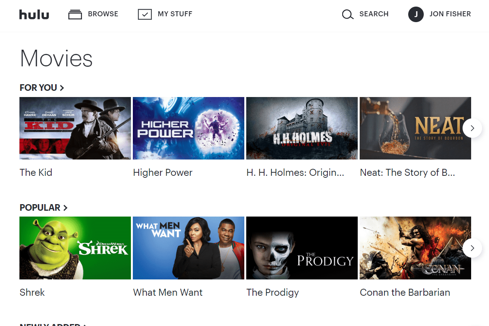

<!--
How to do a release and publish modules:

1. Make sure you have publish access for all packages:
    - You must be in the developers team in the npm @ergonode organization
    - You must have publish access to all @ergonode modules
2. Create release branch from develop branch (release/v0.9.0).
3. Switch to release branch and edit everything you need for the release.
4. Run `npm run publish:all ${semver}` - semver is semantic version (1.0.0, major, minor, path, etc.)
5A. If everything works properly, all modules are published and CHANGELOG will be created
5B. If the publish fails half-way, things have gotten hairy. Now you need to
    go to npm to check which packages have been published and manually publish
    the ones that have not been published yet.
5. Edit CHANGELOG and other things and push changes to release branch.
4. Go to GitHub and merge release branch to master branch.
5. Go to GitHub and verify that the changelog is live.
6. Go to GitHub releases page and publish the release.
7. Merge master branch to develop branch.

 -->
<p align="center">
  <a href="https://hulu.com" rel="noopener noreferrer">
    
  </a>
</p>
<p align="center">Hulu Movie Streaming Website Clone</p>

<p align="center">
<!--   <a href="https://hulu.com">
    

  </a> -->
<!--   <a href="https://hulu.com">
    
  </a> -->
  <a href="https://join.slack.com">
    
  </a>
  <a href="https://devs.to/franc15">
    
  </a>
  <a href="https://github.com/ergonode/frontend/blob/master/LICENSE.txt">
    
  </a>
<!--   <a href="https://lerna.js.org">
    
  </a> -->
</p>
<br>



<br>

## Project Introduction
Welcome to the Hulu Clone project! This is a frontend project that aims to replicate the functionality and design of the popular movie streaming website, Hulu. The project has been built using modern frameworks such as React and Bootstrap, with the goal of creating a user-friendly and responsive web application.

The main objective of this project is to provide a platform where users can stream movies and TV shows with ease, just like they do on the original Hulu website. The project features a clean and intuitive user interface, designed to provide an enjoyable and seamless viewing experience for all users.

## Installation

**1) Startup**

Clone project repository to your local directory:

```bash
git clone [git@github.com:/frontend.git](https://github.com/Franc15/alc-lab-hulu-clone.git)
```

Install project dependencies:

```bash
npm install
```

Set your local `.env` file:

```bash
npm run env
```
> *You may want to override created .env file by other settings*

**2) Module configuration**

Follow **CLI** steps to configure project:

```bash
npm run modules
```

You might want automatically setup all modules by executing command:
```bash
npm run modules:all
```
> All available modules can be found in the `package.json` file in the `_availableModules` section, and required modules in the `_requiredModules` section.

> The `_availableModules` is an object where the key is the module name and the value is the module type.
The `local` type defines local modules located in the `modules` directory, and the `npm` type defines modules hosted on npm.

**3) Build**

Run development mode

```bash
npm run dev
```

Run production mode

```bash
npm run build
npm run start
```

<!-- > *After you set up [backend application][backend] and generated default fixtures you may login into application with credentials `test@ergonode.com`, password: `abcd1234`* -->

<!-- **4) Docker**

Installation guide at [docker repository][docker] -->

## Browser

We recommend using the latest version of **Chrome** browser.
On other browsers some functionalities may not work as intended.

## Documentation

The project is in early stage and we have got a lot of milestones to develop.  We do our best to deliver great documentation, but - to be honest -  it is the hardest thing in open-source projects :)

**Please find out what we've already prepared on [devs.nolinkyet.com][docs]**

## Technologies

- Node.js
- React JS
- Bootstrap
- Axios

## Contact us

If you have any questions or ideas feel free to join our [slack][slack].

## Is it production ready

Sadly, not yet!
## Contributing

Before you start making any pull requests checkout our [contribution guide][contribut]. If you have any questions or ideas feel free to join our [slack][slack] or send us an email: team@ergonode.com

## Partners

Hulu Clone is open-source, and it can be brought to you only by great community and partners supported by our core team. If you want to be on that list please send us an email: f.kikulwe@alustudent.com

## The license

hulu clone source code is released under the [GPL 3.0 License][license].

[slack]: https://join.slack.com
[contribut]: https://devs.franc15.com/#/community/contribution
[license]: ./LICENSE.txt
[roadmap]: https://ergonode.com/features/#roadmap
[docs]: https://docs.google.com
[ddd]: https://en.wikipedia.org/wiki/Domain-driven_design
[cqrs]: https://en.wikipedia.org/wiki/Command%E2%80%93query_separation
[es]: https://dev.to/barryosull/event-sourcing-what-it-is-and-why-its-awesome
[backend]: https://github.com/Franc15/backend
[frontend]: https://github.com/Franc15/frontend
[docker]: https://github.com/Franc15/docker

